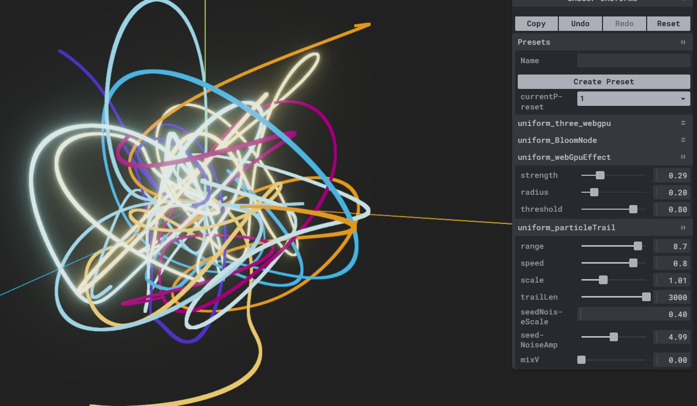

# particleTrail

> 使用粒子来模拟trail
> 将mx_noise函数看作为一个path函数, 通过instanceIndex来区分和切割分段,idx被当作progress了
> 也就是说 pos = path(idx*scale) scale来控制粒子的间隙,越小越像是连贯的线条. 另外还可以用普通的sin函数来模拟path
> 这里又一个mixV来混合两种path效果,还挺有意思的
